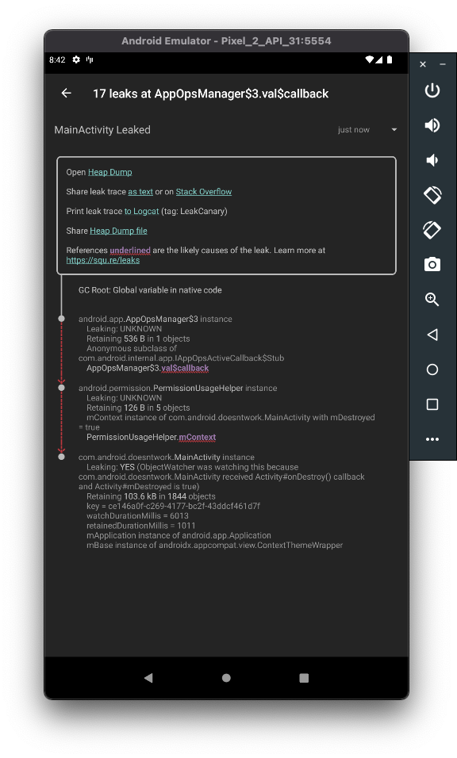

```text
┬───
│ GC Root: Global variable in native code
│
├─ android.app.AppOpsManager$3 instance
│    Leaking: UNKNOWN
│    Retaining 536 B in 1 objects
│    Anonymous subclass of com.android.internal.app.IAppOpsActiveCallback$Stub
│    ↓ AppOpsManager$3.val$callback
│                      ~~~~~~~~~~~~
├─ android.permission.PermissionUsageHelper instance
│    Leaking: UNKNOWN
│    Retaining 126 B in 5 objects
│    mContext instance of com.android.doesntwork.MainActivity with mDestroyed =
│    true
│    ↓ PermissionUsageHelper.mContext
│                            ~~~~~~~~
╰→ com.android.doesntwork.MainActivity instance
​     Leaking: YES (ObjectWatcher was watching this because com.android.
​     doesntwork.MainActivity received Activity#onDestroy() callback and
​     Activity#mDestroyed is true)
​     Retaining 103.6 kB in 1844 objects
​     key = ce146a0f-c269-4177-bc2f-43ddcf461d7f
​     watchDurationMillis = 6013
​     retainedDurationMillis = 1011
​     mApplication instance of android.app.Application
​     mBase instance of androidx.appcompat.view.ContextThemeWrapper

METADATA

Build.VERSION.SDK_INT: 31
Build.MANUFACTURER: Google
LeakCanary version: 2.7
App process name: com.android.doesntwork
Stats: LruCache[maxSize=3000,hits=3205,misses=129507,hitRate=2%]
RandomAccess[bytes=6418115,reads=129507,travel=49266415844,range=29286535,size=3
6161751]
Heap dump reason: 15 retained objects, app is visible
Analysis duration: 6696 ms
```
1.  https://issuetracker.google.com/issues/207946473
